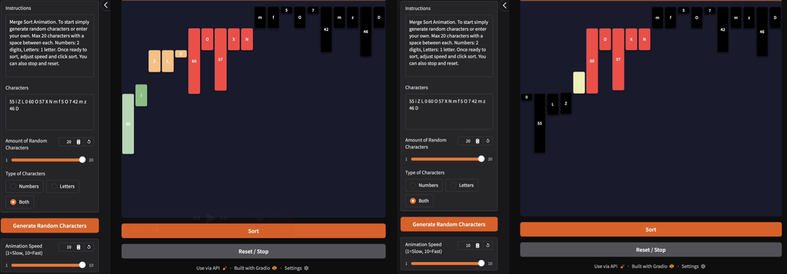
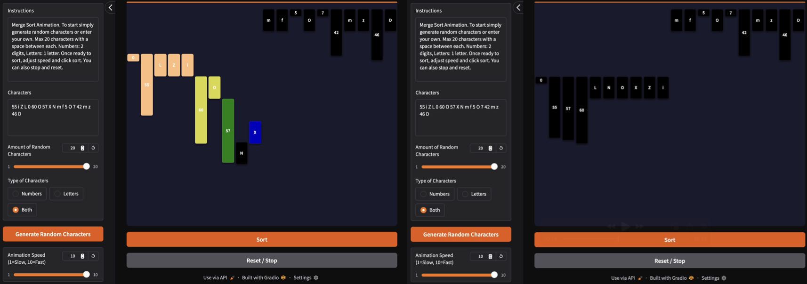
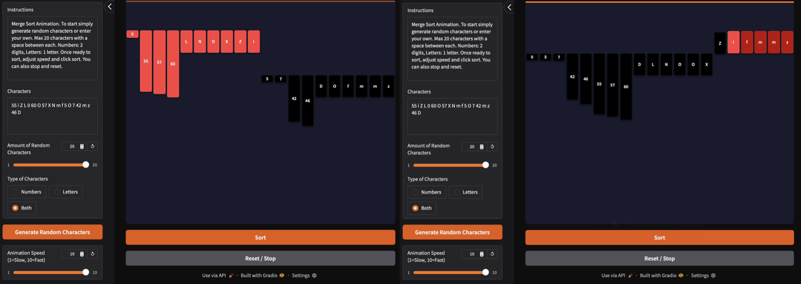
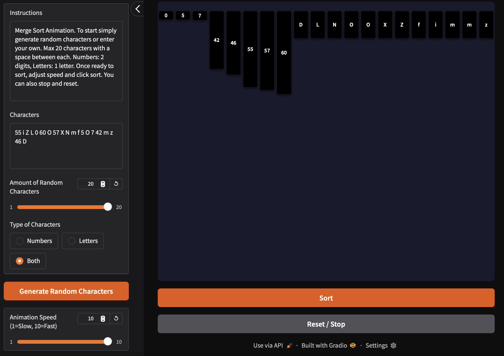
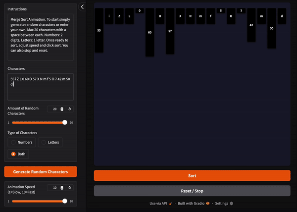
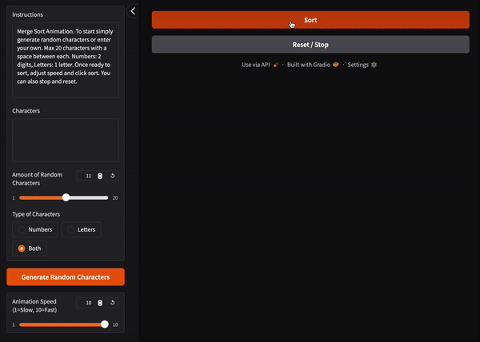
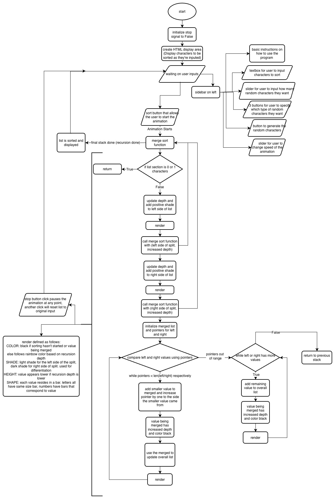

# CISC_121_Final_Project
# Merge Sort
#### I Choose merge sort because it is one of the best sorting algorithims since it has an average complexity of O(nlogn). It is also one of the more complex algorithims, so I feel like I could learn more trying to animate it. Also because it's one of the more complex algorithims, people might struggle with it more meaning this visual might help more than a visual for other algorithims. 
# Demo video/gif/screenshot of test
### Full Animation Steps

#### Original list first fully displayed as black. First frame shows splitting stage and how the original list splits into the left multiple times as the blocks go down. Each level corresponds to recursion depth, each depth has a different color. Also a lighter shade is used on the left split while a darker shade is used on the right split so its easy to tell them apart. The second frame shows how the lowest sorted left side merges with the lowest sorted right side. The blocks are black if they are in the merge stage.
---

#### The third frame continues to show the splitting and merging of small sections of the list. The fourth frame shows the full left side done the merging stage which means the left side is completely sorted.
---

#### The fifth frame shows how the right side has gone through the same steps as the left side to split and merge. Now the left and right side are independently sorted. The sixth frame shows the left and right side in the final merge stage.
---

#### The seventh frame shows the final sorted list. Sorted in the order numbers, uppercase letters, lowercase letters.
---

#### This gif shows testing the input constraints.
#### Constraints include:
- max 20 characters
- 1 or 2 digit numbers
- singular uppercase or lowercase
- no special characters
---

#### This gif shows testing button spamming.
#### Spamming the following:
- Spamming sort and reset button with no characters
- Spamming sort and reset button with one characters
- Spamming generate random characters button
---
# Problem Breakdown & Computational Thinking (You can add a flowchart and write the four pillars of computational thinking briefly in bullets)
### Problem Decomposition:
- This problem has many steps. The first step is the user input. This involves 3 things: manual input, random generation, speed slider. All these inputs happen before the sorting even begins. The next step in the problem happens as the input happends. The input has to be filtered and modified to make sure it doesnt break the code. The third step is the sorting itself. Taking the input and putting it thorugh the merge sorting process. The fourth step is the hardest, the animation. The animation consists of two things happening simultaneously to the sorting procces. As the sort happens the animation first has to update the properties of each item like height and color, then the animation also has to render in items each time.
### Pattern Recognition:
- There are two main patterns in this problem. The first one is the merge sort it self. The sort constantly splits the list in half, then merges the already halves. For this we could use recursion for this repetative pattern. The other pattern is the item properties. Each color and height for the items represents the sorting process. This means we can create a general function that connects the properties to the sorting steps. And then we can easily repetitively use this function to update item properties.
### Abstraction:
- We dont need to worry about using words to state what is going on with the sort process. Instead we will use colors and block heights to visually show the sorting process. We also dont need to worry about sorting a mix of numbers and letters since they are still comparable characters.
### Algortihmic Thinking:
- The main input is the list to be sorted. This can be done manually or with the generate random characters button. The contraints for this input are numbers or letters, no special characters. Also the numbers can be 1 or 2 digits, while letters are singular uppercase or lowercase. Another constraint is no double spaces, this prevents infinite spaces making the list to long. These contraints are enforced by the program. Other inputs are the speed slider, sort button, and reset button. The output is the animation itself and ultimately the sorted list.

# Steps to Run
#### 1. Manually input a list makeing sure theres a space between each character, and that each character is either a 1/2 digit number or singular upper/lowercase letter. You could also use the amount of characters slider, character type buttons, and generate random characters button to create a random list.
#### 2. Choose a speed for the animation using the slider. 1 is slowest while 10 is fastest.
#### 3. Click sort button to begin animation.
#### 4. Wait for the list to finish sorting or use reset button to begin again.
# Hugging Face Link
[Go To Hugging Face Space](https://huggingface.co/spaces/SebSanchez1/CISC_121_Final_Project_Space)
# Author & Acknowledgment
#### Created by Sebastian Sanchez. Used Gradio website for basic syntax to create base program. Used Antigravity for majority of the complex animation process to imbed animation while the sort happens.
